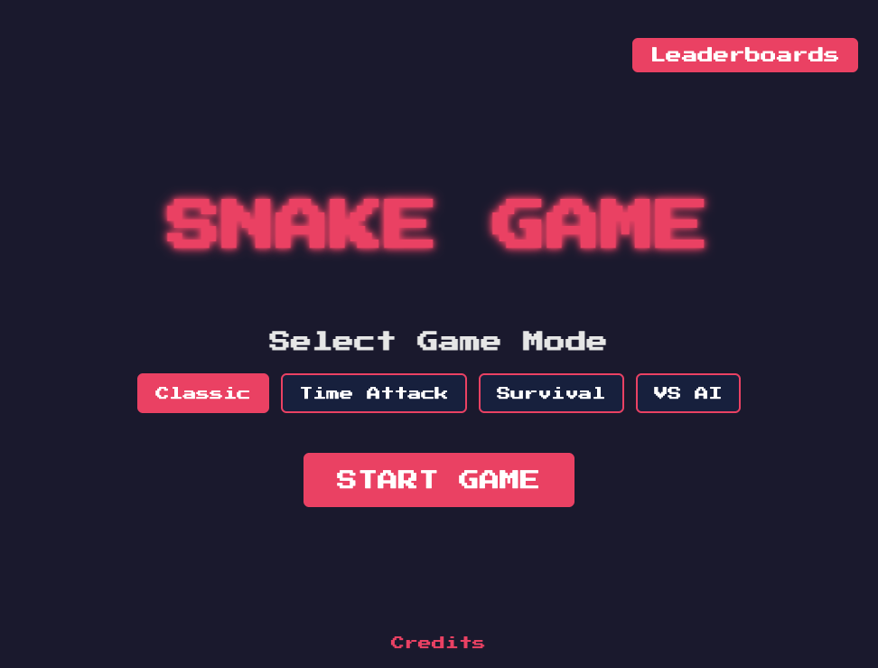

# Snake Game

A modern, feature-rich implementation of the classic Snake game with multiple game modes, leaderboards, and special features. Built with JavaScript and Node.js.



## Features

### Game Modes
- **Classic Mode**: Traditional snake gameplay where you grow longer by eating food
- **Time Attack**: Race against time to get the highest score possible in 120 seconds
- **Survival Mode**: Dodge randomly appearing blocks while collecting food
- **VS AI**: Compete against an AI snake for food and survival

### Special Features
- Beautiful parallax star background
- Real-time leaderboards for each game mode
- Sound effects and background music
- Power-ups in certain game modes
- Responsive controls
- Score tracking and high scores
- Modern UI with retro aesthetics

## Prerequisites

Before you begin, ensure you have the following installed:
- [Node.js](https://nodejs.org/) (version 14 or higher)
- [npm](https://www.npmjs.com/) (usually comes with Node.js)

## Installation

1. Clone the repository:
```bash
git clone https://github.com/Netkomm/ai-snake
cd ai-snake
```

2. Install dependencies:
```bash
npm install
```

This will install required packages:
- express
- sqlite3
- sqlite
- cors

## Running the Game

1. Start the server:
```bash
node server.js
```

2. Open your web browser and navigate to:
```
http://localhost:3000
```

## Game Controls

- **Arrow Keys**: Control snake direction
- **Space**: Start game / Pause game
- **ESC**: Return to menu
- **M**: Toggle music
- **P**: Toggle pause

## Project Structure

```
snake-game/
├── assets/
│   ├── audio/         # Game sounds and music
│   └── images/        # Game images and icons
├── src/
│   ├── game.js        # Main game logic
│   ├── gameState.js   # Game state management
│   ├── ai.js          # AI snake logic
│   ├── database.js    # Database interface
│   └── ui.js          # UI management
├── data/              # SQLite database files
├── server.js          # Express server
├── index.html         # Main game page
├── credits.html       # Credits page
└── package.json       # Project dependencies
```

## Database Structure

The game uses SQLite for data persistence with two main tables:

### scores
- id (PRIMARY KEY)
- mode (TEXT)
- player_name (TEXT)
- score (INTEGER)
- created_at (DATETIME)

### high_scores
- mode (TEXT PRIMARY KEY)
- score (INTEGER)
- player_name (TEXT)
- updated_at (DATETIME)

## Deployment

To deploy on a production server:

1. Clone the repository on your server
2. Install dependencies:
```bash
npm install --production
```

3. Configure your web server (e.g., nginx) to proxy requests to the Node.js application
4. Start the server using a process manager like PM2:
```bash
pm2 start server.js --name snake-game
```

## Security Considerations

- The game uses CORS protection
- Input validation for player names and scores
- SQLite database is stored in a separate data directory
- Transactions for data integrity

## Contributing

1. Fork the repository
2. Create your feature branch
3. Commit your changes
4. Push to the branch
5. Create a new Pull Request

## License

This project is licensed under the MIT License - see the LICENSE file for details.

## Credits

- Game Development: Nello Castellano
- Sound Effects: Various Sources
- Font: Press Start 2P by CodeMan38
- Development Tools: Trae, Cursor, and Claude Sonnet 3.5/3.7

## Support

For support, please open an issue in the GitHub repository or contact [your contact information].

## Acknowledgments

- Thanks to all contributors and players
- Special thanks to the open-source community
- Inspired by the classic Snake game 